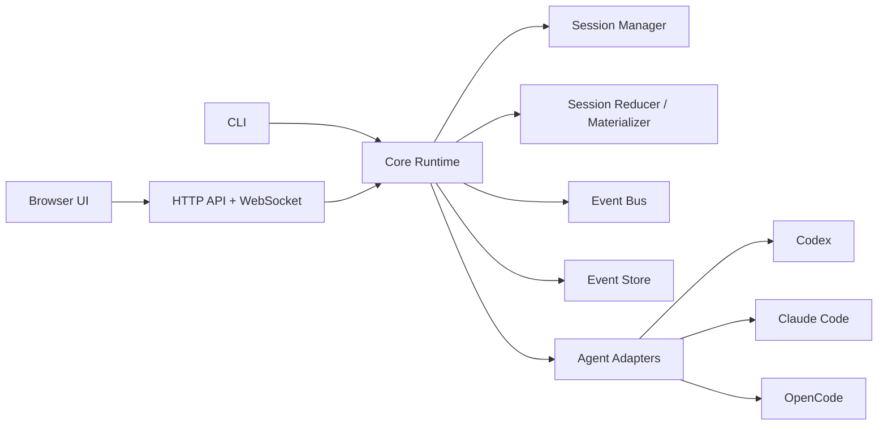

# Architecture Specification

## 1. Architectural Principles

- **Local-first:** v1 must work on one developer machine without remote orchestration.
- **Normalized truth:** persisted normalized events plus materialized snapshots define session truth.
- **Single replay model:** one reducer/materializer model must drive replay, recovery, API summaries, and UI expectations.
- **Adapter isolation:** vendor-specific launch/config/transport logic stays inside adapters.
- **Recoverability first:** browser refresh, daemon restart, and adapter restart are expected scenarios.
- **Truthful capability reporting:** the system must never promise stronger transport, attach, or security guarantees than a given adapter actually provides.
- **Fast shell first:** expensive readiness/probe work must not block the first usable dashboard or session shell.

## 2. Architecture Decision Gate

Before broad implementation, the project must answer a single architecture gate:

- **Default decision:** keep the current Fastify + server-served modular SPA architecture.
- **Escalation rule:** refactor only if the docs audit proves the current structure blocks a release-critical requirement such as replay truth, adapter integration, accessibility, or testability.
- **If refactoring is required:** the change must be narrow, documented, and justified by a specific blocked requirement.

For v1, the default assumption is **keep the current structure** and improve modularity within it.

## 3. Recommended Technology Baseline

The production baseline for this repository is:
- Node `>=20`
- TypeScript with ESM for backend/runtime logic
- Fastify for HTTP + WebSocket server behavior
- a server-served browser UI built from modular JavaScript/CSS/HTML assets
- Vitest for unit and integration testing
- Playwright for browser E2E and live validation

Equivalent replacements are allowed only when the architecture decision gate records why the change is necessary.

## 4. Runtime Components

The system consists of:
- `SessionManager`
- `SessionReducer` / materializer
- `EventBus`
- `EventStore`
- `AgentAdapters`
- `AuthManager`
- `Doctor`
- `WebServer`
- `BrowserUI`
- `CLI`



## 5. Recommended Source Layout

```text
src/
  adapters/
    base.ts
    codex/
    claude/
    opencode/
    fake/
  cli/
  core/
    auth/
    config/
    doctor/
    event-store/
    session-manager/
    session-reducer/
    retention/
  server/
    api/
    websocket/
  shared/
    contracts/
    errors/
    ids/
    logging/
    redaction/
  ui/
    app/
    routes/
    components/
    state/
    transport/
    styles/
```

The existing flatter file layout is acceptable temporarily, but the implementation should modularize toward these boundaries as code grows.

## 6. Core Domain Model

### 6.1 Session Status

Required normalized statuses:
- `starting`
- `idle`
- `running`
- `waiting_approval`
- `waiting_question`
- `waiting_plan`
- `restarting`
- `terminating`
- `terminated`
- `error`

### 6.2 Session Identity

A normalized session id must remain stable across:
- adapter restarts
- mode changes
- reconnects
- daemon restarts

Vendor session identifiers are adapter-owned opaque state and must never replace the normalized session id.

### 6.3 Plan Request vs Plan Mode

- `mode: plan` is a session mode.
- `pendingActions.type === 'plan'` represents a plan request.
- The reducer, API, and UI must keep those concepts separate so a session can be in build mode while still holding a pending plan request, or be in plan mode without one.
- Current code already models the distinction through separate mode state and pending-action event types (`plan.requested` / `plan.resolved`).

### 6.4 Session Truth Model

Each session has:
- append-only normalized event log
- latest materialized snapshot
- derived summary view
- adapter-owned opaque state
- optional terminal mirror stream/log

The reducer/materializer must be the only logic allowed to derive:
- current status
- pending action queue
- visible mode/policy
- summary timestamps and sequences
- replay state after restart

## 7. Session Manager

`SessionManager` is responsible for:
- creating sessions
- resuming/reconciling sessions on startup
- routing user input
- applying mode and policy changes
- resolving pending actions
- terminating or force-terminating sessions
- emitting normalized events
- updating snapshots and active-session indexes

Required behavior:
- exactly one active runtime handle per normalized session id
- per-session mutation serialization (queue/lock) so conflicting operations cannot interleave unsafely
- explicit startup/restart/terminate timeouts
- idempotent handling for client-submitted messages and create-session requests
- startup reconciliation with adapters for non-terminated sessions

## 8. Session Reducer / Materializer

A dedicated reducer/materializer is mandatory.

It must:
- accept normalized events in sequence order
- produce the current `SessionDetail` and `SessionSummary`
- rebuild truth from snapshot + event replay
- tolerate replay after crash or daemon restart
- invalidate or resolve pending actions correctly on later events

No API route, websocket broadcaster, or UI code may reimplement its own session truth rules.

## 9. Event Bus

The `EventBus` is the in-memory fan-out layer between adapters, runtime services, websocket subscribers, and tests.

Requirements:
- publish/subscribe by session id
- preserve per-session event ordering
- tolerate slow consumers without corrupting runtime state
- support internal subscribers used by tests and observability

The bus is not the durable source of truth; it is a transient transport over durable event storage.

## 10. Event Store

The `EventStore` is the durable source of truth for session timelines.

Required behavior:
- append-only per-session JSONL event log
- monotonic per-session sequence number
- unique event ids
- latest snapshot per session
- active-session index for fast startup
- crash-safe append and atomic snapshot updates
- replay from an exclusive cursor
- trailing partial-line tolerance after crash

Replay must be sufficient to rebuild:
- transcript timeline
- session status
- pending actions
- mode and execution policy
- visible terminal mirror history when retained

## 11. Process And Transport Model

Each adapter must declare one minimum releasable transport:
- `pty`
- `http`
- `hybrid`
- `internal` (test-only adapters such as fake)

Optional affordances such as `tmux` attach or open-directory actions are capability-gated extras.

Rules:
- the core runtime must not assume a pane, pid, or resumable terminal exists for every adapter
- attach may only be exposed when the adapter explicitly reports support
- lack of attach support must not block release of an otherwise functional adapter

## 12. Recovery Model

On daemon startup:
1. load config and storage paths
2. load snapshots and active-session index
3. rebuild or validate summaries with reducer/materializer logic
4. for each non-terminated session, ask the adapter to reconcile runtime state
5. append explicit recovery, restart, or error events when reconciliation changes visible state
6. accept websocket clients and serve replay from stored sequences

Recovery precedence:
- event log wins over snapshot for sequence and pending-action truth
- snapshot wins over active-session index for summary fields
- adapter reconciliation may append new events but must not silently rewrite persisted history

## 13. Web Server And UI Contract

The web server must:
- serve UI assets
- expose JSON API routes
- expose a WebSocket event stream
- enforce local auth / password auth rules
- expose health and doctor surfaces needed by CLI and tests

The UI must:
- fetch initial state from HTTP
- render a usable shell before slow readiness hydration completes
- apply live updates from WebSocket replay/event messages
- reconnect from the last known per-session sequence
- render only normalized state, not terminal parsing heuristics

## 14. Security Boundaries

Required security rules:
- default bind is `127.0.0.1`
- non-loopback bind requires password auth
- state-changing browser requests require CSRF protection
- secrets are redacted before logs, doctor output, API responses, and persisted diagnostics
- capability/policy displays must be honest about real adapter/runtime limits
- adapter-specific option schemas must not create shell-injection paths

The application orchestrates agent runtimes. It does **not** provide a stronger sandbox than the underlying agent/runtime actually enforces.

## 15. Logging And Observability

Required persisted logs:
- daemon lifecycle log
- per-session event log
- per-session terminal mirror log when retained
- adapter probe log

Required counters/metrics or equivalent observable summaries:
- active session count
- session start success/failure counts
- event append failures
- websocket subscriber count
- recovery attempts and failures
- pruning actions
- per-adapter probe health

Logs must be structured and redact sensitive fields before persistence.

## 16. Non-Functional Requirements

The shipped implementation must support:
- warm startup to usable dashboard within 3 seconds on a healthy local machine
- session creation to first visible state within 2 seconds when the adapter is healthy
- reconnect to visible transcript within 2 seconds on a local machine
- reliable replay with at least 10,000 events per session
- reliable retained-history behavior with at least 100 active/recent sessions

## 17. Extensibility Rules

Future adapters or UI extensions may be added only if they:
- preserve normalized contracts
- do not bypass the reducer/materializer model
- do not overstate capabilities
- do not require breaking API changes for v1 routes
