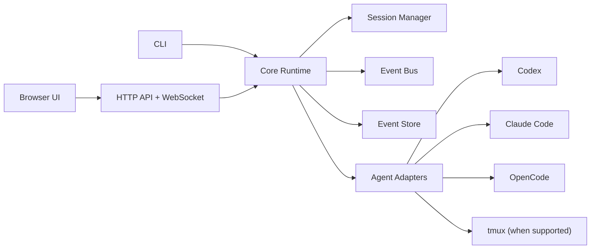
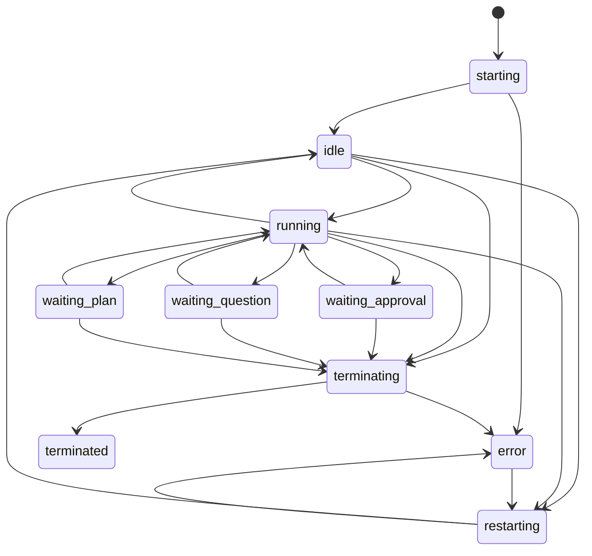

# Architecture Specification

## 1. Architectural Principles

- Local-first: all core functionality must work on one developer machine without external orchestration.
- Adapter isolation: agent-specific behavior must be contained behind a narrow contract.
- Event-sourced session state: durable session truth comes from append-only events plus resumable snapshots.
- UI from normalized state: browser logic must depend on normalized events and pending actions, not fragile terminal parsing.
- Recoverability first: refresh, daemon restart, and adapter restart are expected, not exceptional.
- Thin transport edges: CLI and web UI are clients of the same core runtime.

## 2. Recommended Technology Baseline

This spec is framework-flexible, but the recommended baseline is:

- Node `>=20`
- TypeScript with ESM
- Fastify or equivalent HTTP server with WebSocket support
- React with Vite for the browser UI
- Vitest for unit and integration testing
- Playwright for browser E2E and live validation

Equivalent alternatives are allowed only if they preserve the runtime contracts and testability defined by this spec.

## 3. Runtime Components

The system consists of four core subsystems plus shared infrastructure:

- `SessionManager`
- `EventBus`
- `EventStore`
- `AgentAdapters`
- `WebServerAndUI`
- shared config, logging, doctor, and CLI layers



## 4. Recommended Source Layout

```text
src/
  cli/
  server/
    api/
    websocket/
  ui/
    app/
    routes/
    components/
  core/
    session-manager/
    event-bus/
    event-store/
    doctor/
    policies/
  adapters/
    base/
    codex/
    claude/
    opencode/
  shared/
    schemas/
    validation/
    ids/
    logging/
    errors/
test/
  unit/
  integration/
  e2e/
  live/
```

## 5. Core Domain Model

## 5.1 Session Status

Required normalized session statuses:

- `starting`
- `idle`
- `running`
- `waiting_approval`
- `waiting_question`
- `waiting_plan`
- `restarting`
- `terminating`
- `terminated`
- `error`

## 5.2 Session Lifecycle



## 5.3 Session Identity

A session id must be stable across:

- adapter restarts
- mode changes
- reconnects
- daemon restarts

The underlying vendor session id may change during recovery or restart, but that vendor id must be stored in adapter state and never replace the normalized session id.

## 6. Session Manager

`SessionManager` is responsible for:

- creating sessions
- resuming sessions
- routing user input to the correct adapter
- applying mode and policy changes
- resolving pending actions
- terminating sessions
- materializing session summary state from events

Required behavior:

- exactly one active runtime handle per normalized session id
- per-session concurrency control so conflicting commands cannot mutate the same session simultaneously
- stable summary rebuild from event replay
- explicit timeouts for startup, restart, and terminate flows

## 7. Event Bus

The `EventBus` is the in-memory fan-out mechanism used by:

- adapters
- session manager
- API handlers
- WebSocket broadcasters
- test fixtures

Requirements:

- publish and subscribe by session id
- backpressure-safe broadcast to slow listeners
- event ordering preserved per session
- internal events may exist, but only normalized public events may leave the core boundary

## 8. Event Store

The `EventStore` is the durable source of truth for session timelines.

Requirements:

- append-only per-session event log
- monotonic per-session sequence number
- event id unique across all sessions
- snapshot file for fast session list and recovery
- replay API that can read from sequence cursor
- crash-safe append behavior

Event replay must be sufficient to rebuild:

- transcript timeline
- session status
- pending action queue
- terminal mirror
- current mode
- current execution policy

## 9. Adapter Boundary

Adapters are the only subsystem allowed to know vendor-specific launch flags, hooks, server APIs, config generation, or permission semantics.

Core runtime responsibilities:

- request normalized operations
- receive normalized events
- store opaque adapter state without inspecting vendor internals

Adapter responsibilities:

- translate normalized operations into vendor operations
- map vendor events into normalized events
- expose capability metadata
- probe install and auth readiness

## 10. Process Model

There are two transport classes:

- `pty`
  - local interactive process, optionally managed through `tmux`
- `http`
  - local or loopback server API
- `hybrid`
  - both, depending on selected adapter options

`tmux` is the default attach substrate for `pty` and `hybrid` adapters that expose attach support.

The core runtime must not assume every adapter has:

- a tmux pane
- a local pid
- a resumable terminal UI

## 11. Recovery Model

On daemon startup:

1. Load config.
2. Load active session snapshot index.
3. For each non-terminated session, ask the adapter to reconcile runtime state.
4. Append recovery or error events when reconciliation changes status.
5. Reopen WebSocket broadcast streams for new browser connections.

Recovery rules:

- a session is never silently discarded
- unrecoverable sessions transition to `error` with a visible reason
- pending actions remain present until explicitly resolved or invalidated by an adapter event

## 12. Web Server And UI Contract

The web server must:

- serve the SPA assets
- expose the JSON API
- expose the WebSocket event stream
- enforce local auth
- provide a health endpoint for live tests and daemon status

The UI must:

- treat the HTTP API as the source of initial state
- treat the WebSocket as the source of live updates
- be able to reconnect from the last known event cursor

## 13. Security Boundaries

The application is not a sandbox manager. It orchestrates agent runtimes and reflects their effective permissions.

Required security boundaries:

- default bind `127.0.0.1`
- explicit opt-in for non-loopback bind
- password required for non-loopback bind
- CSRF-safe local auth strategy for browser requests
- dedicated auth session endpoints for browser bootstrapping and logout
- secrets redaction in logs, doctor output, and API responses
- no shell command injection from adapter-specific option schemas

OpenCode-specific note:

- OpenCode permissions are a user experience layer, not a substitute for OS sandboxing. The product must present effective permissions honestly and must not imply stronger isolation than the underlying runtime provides.

## 14. Logging And Observability

Required logs:

- daemon lifecycle log
- per-session event log
- per-session terminal mirror log
- adapter probe log

Logging rules:

- structured JSON for machine-readable logs
- human-readable summaries for CLI doctor output
- sensitive fields redacted before persistence

Required metrics or counters:

- active session count
- session start success and failure counts
- event append failures
- WebSocket subscriber count
- adapter probe health

## 15. Non-Functional Requirements

- startup to ready dashboard on a warm machine in under 3 seconds
- session creation should surface first visible state within 2 seconds when the adapter is locally healthy
- event append and replay must remain reliable with at least 100 active sessions in retained history
- browser refresh recovery must tolerate at least 10,000 events per session

## 16. Extensibility Rules

Future adapters may be added only if they implement the adapter contract and doctor contract defined in this spec.

Future UI surfaces may be added, but they must not:

- bypass normalized events
- encode vendor-specific logic in generic components
- require breaking API changes for the initial routes
